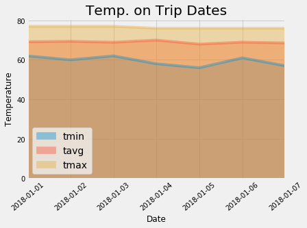

# Climate App using SqlAlchemy

We build apps to retrieve the weather data of Climate in Honolulu, Hawaii using SqlAlchemy and Flask. Using matplotlib, the analysis for several questions is shown via bar, candle chart or histogram.

## Climate App
Using Flask and 

* /api/v1.0/precipitation

  The precipitation data for the last 12 months

* /api/v1.0/stations

  The station names in the database

* /api/v1.0/tobs

  The observed temeratures of the most active stations for the last 12 months

* /api/v1.0/<start> and /api/v1.0/<start>/<end>

  The minimum, average and maximum of temperatures from the given <start> date
  
  The minimum, average and maximum of temperatures from <start> to <end> dates

## Analysis

### precipitation

## TOBS

### How is the weather during 'vacation'?

* Vacation range is approximately 3-15 days

* Calculate the min, avg, and max temperatures for your trip using the matching dates from the previous year (i.e., use "2017-01-01" if your trip start date was "2018-01-01")

* Calculate the rainfall per weather station using the previous year's matching dates.

* Calculate the daily normals. Normals are the averages for the min, avg, and max temperatures.

  
  
